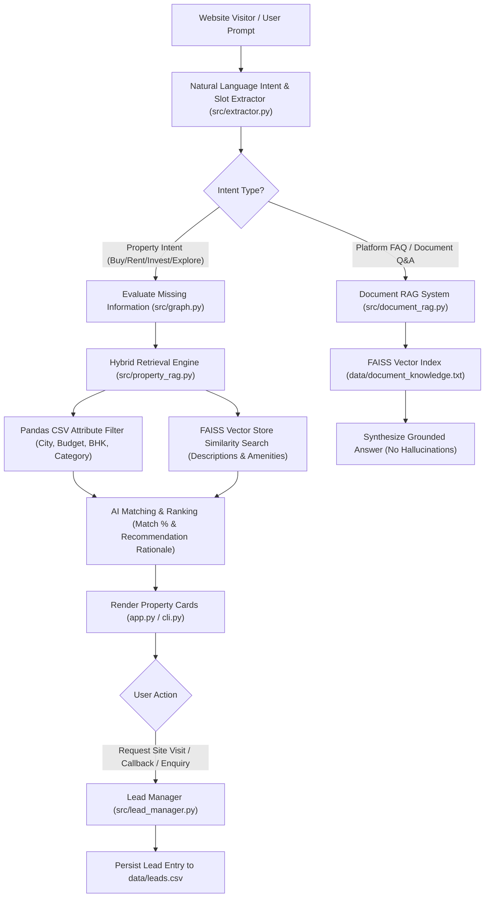

# PropwiseAI — Customer RAG AI Chatbot System

An AI-driven real estate customer assistant powered by **LangChain**, **LangGraph**, **FAISS Vector Search**, **SentenceTransformers**, **Pandas**, and **Streamlit**.

---

## 🌟 Executive Summary

The **PropwiseAI Chatbot** converts natural language customer requirements into structured property searches and guides website visitors from discovery to enquiry.

When no existing backend API or database is available, this system acts as a complete, standalone solution that reads property listings from `data/properties.csv`, broker profiles from `data/brokers.csv`, stores CRM leads directly into `data/leads.csv`, and performs Retrieval-Augmented Generation (RAG) over `data/document_knowledge.txt` (the PropwiseAI functional requirements document).

---

## 📐 Architecture & Flow Diagram



## 📁 File & Project Directory Structure

```
c:\PROPWISE\
├── data/
│   ├── brokers.csv               # Realtor records (ID, name, agency, phone, RERA license)
│   ├── properties.csv            # Live property inventory (ID, title, price, city, BHK, amenities)
│   ├── leads.csv                 # Generated CRM leads created by chatbot requests
│   └── document_knowledge.txt    # PropwiseAI requirements document for RAG Q&A
├── vector_store/                 # Persisted FAISS vector index directories
│   ├── doc_faiss_index/
│   └── property_faiss_index/
├── src/
│   ├── __init__.py
│   ├── config.py                 # Paths and model configuration
│   ├── embeddings.py             # Local SentenceTransformer embedding generator
│   ├── document_rag.py           # FAISS Document RAG Q&A engine
│   ├── property_rag.py           # Hybrid property search & recommendation engine
│   ├── extractor.py              # Natural language intent detection & slot extraction
│   ├── lead_manager.py           # CSV CRM lead persistence manager
│   └── graph.py                  # LangGraph workflow orchestration & state machine
├── app.py                        # Streamlit Web Application UI
├── cli.py                        # Command Line Interface (CLI) interactive tester
├── requirements.txt              # Project Python dependencies
└── README.md                     # Comprehensive system documentation
```

---

## 🚀 Quickstart Guide

### 1. Install Dependencies
```bash
pip install -r requirements.txt
```

### 2. Launch the Streamlit Web UI (Recommended)
```bash
streamlit run app.py
```
Open your browser at `http://localhost:8501` to test:
- Interactive AI Chatbot with property card rendering.
- Quick action prompt buttons.
- Real-time Site Visit & Callback registration forms.
- Live Inventory & CRM Lead Management dashboards.

### 3. Run Command-Line Tester (CLI)
```bash
python cli.py
```

---

## 📋 Core Capabilities Matrix

| Requirement | Implementation Module | Status |
| :--- | :--- | :---: |
| **Natural Language Intent Extraction** | `src/extractor.py` | ✅ Verified |
| **Stateful Context Memory** | `src/graph.py` (PropwiseState) | ✅ Verified |
| **Hybrid FAISS + CSV Property Search** | `src/property_rag.py` | ✅ Verified |
| **Document RAG Q&A** | `src/document_rag.py` | ✅ Verified |
| **Lead & Site-Visit Persistence** | `src/lead_manager.py` -> `data/leads.csv` | ✅ Verified |
| **Interactive Web Application** | `app.py` | ✅ Verified |
